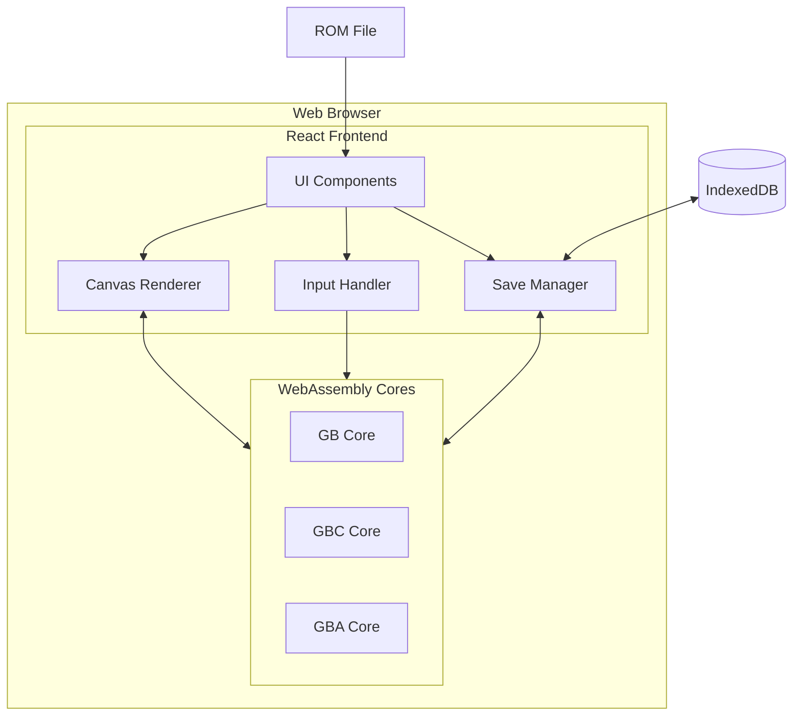

# Software Requirements Specification (SRS)
# NeoBoy - Multi-Core Game Boy Emulator

**Version:** 1.0  
**Date:** December 2025  
**Status:** Initial Release

---

## 1. Introduction

### 1.1 Purpose

This Software Requirements Specification (SRS) document describes the functional and non-functional requirements for **NeoBoy**, a web-based multi-core emulator for Nintendo handheld game consoles. The document serves as a reference for developers, testers, and stakeholders.

### 1.2 Scope

NeoBoy is designed to accurately emulate three Nintendo handheld systems:

- **Game Boy (DMG)** - 1989
- **Game Boy Color (GBC)** - 1998
- **Game Boy Advance (GBA)** - 2001

The emulator runs entirely in modern web browsers using **WebAssembly** for performance-critical emulation cores and **React** for the user interface.

### 1.3 Definitions and Acronyms

| Term | Definition |
|------|------------|
| DMG | Dot Matrix Game (original Game Boy) |
| GBC | Game Boy Color |
| GBA | Game Boy Advance |
| WASM | WebAssembly |
| PPU | Pixel Processing Unit |
| APU | Audio Processing Unit |
| MMU | Memory Management Unit |
| MBC | Memory Bank Controller |
| ROM | Read-Only Memory (game cartridge) |
| SRAM | Save RAM |
| FPS | Frames Per Second |

---

## 2. Overall Description

### 2.1 Product Perspective

NeoBoy is a standalone web application that:
- Runs in modern browsers without plugins
- Compiles C emulation cores to WebAssembly for near-native performance
- Provides a React-based UI for user interaction
- Stores save data locally using browser storage APIs

### 2.2 Product Functions

1. **Core Emulation**
   - Accurate emulation of GB, GBC, and GBA hardware
   - CPU, PPU, MMU, APU, and cartridge emulation
   - 60 FPS rendering

2. **Input Handling**
   - Keyboard input mapping
   - Gamepad support via Gamepad API

3. **Save/Load System**
   - Save states (full emulator state)
   - Battery-backed SRAM persistence
   - IndexedDB storage for web persistence

4. **ROM Loading**
   - Drag-and-drop ROM files
   - File picker interface
   - ROM validation

5. **User Interface**
   - Core selection (GB/GBC/GBA)
   - Canvas rendering with scaling
   - Controls (play/pause, save/load)
   - FPS display

### 2.3 User Characteristics

- **Target Users**: Retro gaming enthusiasts, emulator developers, casual players
- **Technical Expertise**: Basic computer literacy required
- **Browser Requirements**: Modern browser with WebAssembly support

### 2.4 Constraints

- **Legal**: No commercial ROMs included; users must provide their own
- **Technical**: WebAssembly and IndexedDB support required
- **Performance**: GBA emulation requires modern hardware
- **Audio**: Limited audio implementation in initial release

---

## 3. System Architecture

### 3.1 High-Level Architecture

### 3.2 Component Breakdown

#### 3.2.1 WASM Cores (C)

**Game Boy Core** (`core-gb`)
- **CPU**: Sharp LR35902 (8-bit, Z80-like)
- **PPU**: 160x144, 4 shades, tile-based
- **MMU**: 64KB address space, MBC support
- **APU**: 4 audio channels (placeholder)
- **Cartridge**: ROM and RAM banking

**Game Boy Color Core** (`core-gbc`)
- Extends GB core
- **Color**: 32768 colors (RGB555)
- **VRAM**: 2 banks (16KB total)
- **WRAM**: 8 banks (32KB total)
- **Double-speed mode**: 8.388 MHz

**Game Boy Advance Core** (`core-gba`)
- **CPU**: ARM7TDMI (32-bit RISC)
- **PPU**: 240x160, 15-bit color, multiple modes
- **MMU**: 32-bit address space
- **DMA**: 4 channels for fast transfers
- **Cartridge**: SRAM/Flash/EEPROM saves

#### 3.2.2 React Frontend

**Components**
- `App.jsx`: Main application orchestrator
- `Canvas.jsx`: Framebuffer renderer
- `Controls.jsx`: Play/pause, save/load buttons
- `ROMLoader.jsx`: File picker and drag-and-drop

**Hooks**
- `useInput.js`: Keyboard and gamepad handling
- `useSave.js`: Save state persistence via IndexedDB

---

## 4. Functional Requirements

### 4.1 Core Emulation (FR-CORE)

| ID | Requirement | Priority |
|----|-------------|----------|
| FR-CORE-1 | System shall emulate GB CPU instructions | High |
| FR-CORE-2 | System shall render GB graphics at 160x144 | High |
| FR-CORE-3 | System shall support GBC color palettes | High |
| FR-CORE-4 | System shall emulate ARM7TDMI for GBA | High |
| FR-CORE-5 | System shall render GBA graphics at 240x160 | High |
| FR-CORE-6 | System shall run at 60 FPS target | High |
| FR-CORE-7 | System shall support MBC1, MBC3, MBC5 | Medium |

### 4.2 Input Handling (FR-INPUT)

| ID | Requirement | Priority |
|----|-------------|----------|
| FR-INPUT-1 | System shall accept keyboard input | High |
| FR-INPUT-2 | System shall map arrow keys to D-pad | High |
| FR-INPUT-3 | System shall support gamepad input | Medium |
| FR-INPUT-4 | System shall prevent default browser shortcuts | High |

### 4.3 Save System (FR-SAVE)

| ID | Requirement | Priority |
|----|-------------|----------|
| FR-SAVE-1 | System shall save full emulator state | High |
| FR-SAVE-2 | System shall load saved states | High |
| FR-SAVE-3 | System shall persist saves in IndexedDB | High |
| FR-SAVE-4 | System shall support battery-backed SRAM | Medium |

### 4.4 ROM Loading (FR-ROM)

| ID | Requirement | Priority |
|----|-------------|----------|
| FR-ROM-1 | System shall load ROM files via file picker | High |
| FR-ROM-2 | System shall support drag-and-drop | Medium |
| FR-ROM-3 | System shall validate ROM headers | High |
| FR-ROM-4 | System shall detect core type from ROM | High |

### 4.5 User Interface (FR-UI)

| ID | Requirement | Priority |
|----|-------------|----------|
| FR-UI-1 | System shall display emulator canvas | High |
| FR-UI-2 | System shall provide core selection buttons | High |
| FR-UI-3 | System shall show FPS counter | Medium |
| FR-UI-4 | System shall scale canvas appropriately | High |
| FR-UI-5 | System shall be responsive (mobile/desktop) | Low |

---

## 5. Non-Functional Requirements

### 5.1 Performance (NFR-PERF)

| ID | Requirement | Target |
|----|-------------|--------|
| NFR-PERF-1 | GB/GBC emulation at 60 FPS | Desktop: ≥95%, Mobile: ≥80% |
| NFR-PERF-2 | GBA emulation at 60 FPS | Desktop: ≥90%, Mobile: ≥60% |
| NFR-PERF-3 | ROM load time | <500ms |
| NFR-PERF-4 | Save state creation | <100ms |

### 5.2 Compatibility (NFR-COMPAT)

| ID | Requirement |
|----|-------------|
| NFR-COMPAT-1 | Support Chrome 90+ |
| NFR-COMPAT-2 | Support Firefox 88+ |
| NFR-COMPAT-3 | Support Safari 14+ |
| NFR-COMPAT-4 | Support Edge 90+ |

### 5.3 Usability (NFR-USE)

| ID | Requirement |
|----|-------------|
| NFR-USE-1 | Intuitive UI requiring no manual |
| NFR-USE-2 | Clear visual feedback for actions |
| NFR-USE-3 | Accessible keyboard controls |

### 5.4 Reliability (NFR-REL)

| ID | Requirement |
|----|-------------|
| NFR-REL-1 | No crashes during normal operation |
| NFR-REL-2 | Graceful handling of invalid ROMs |
| NFR-REL-3 | Save states must not corrupt |

---

## 6. System Features

### 6.1 Feature: Game Boy Emulation

**Description**: Emulate original Game Boy hardware

**Inputs**:
- ROM file (.gb extension)
- User input (keyboard/gamepad)

**Processing**:
- Load ROM into memory
- Execute CPU instructions
- Render PPU output
- Process audio (placeholder)

**Outputs**:
- 160x144 RGBA framebuffer
- Audio samples (future)

**Dependencies**: None

---

### 6.2 Feature: Save States

**Description**: Save and restore full emulator state

**Inputs**:
- Save button click
- Load button click

**Processing**:
- Serialize CPU, PPU, MMU state
- Store in IndexedDB
- Restore state from IndexedDB

**Outputs**:
- Success/failure notification
- Restored emulator state

**Dependencies**: IndexedDB API

---

## 7. Data Requirements

### 7.1 ROM Data

- **Format**: Binary (.gb, .gbc, .gba)
- **Size**: 32KB - 32MB
- **Storage**: In-memory only (not persisted)

### 7.2 Save States

- **Format**: Binary blob (CPU + PPU + MMU state)
- **Size**: ~100KB per state
- **Storage**: IndexedDB
- **Key**: `{core_type}_state`

### 7.3 SRAM Data

- **Format**: Binary
- **Size**: 2KB - 128KB
- **Storage**: IndexedDB
- **Key**: `{rom_name}_sram`

---

## 8. Development Roadmap

### Phase 1: Core Implementation (v0.1)
- ✅ Project scaffold
- ✅ Basic C core structure
- ✅ React frontend setup
- [ ] GB CPU instruction set
- [ ] GB PPU tile rendering
- [ ] Basic ROM loading

### Phase 2: Full GB Support (v0.5)
- [ ] Complete GB instruction set
- [ ] Sprite rendering
- [ ] MBC1/MBC3 support
- [ ] Audio (basic)
- [ ] Save states

### Phase 3: GBC Support (v1.0)
- [ ] Color palette system
- [ ] VRAM/WRAM banking
- [ ] Double-speed mode

### Phase 4: GBA Support (v1.5)
- [ ] ARM7TDMI instruction set
- [ ] GBA PPU modes 0-5
- [ ] DMA transfers
- [ ] Flash/EEPROM saves

### Phase 5: Polish (v2.0)
- [ ] Full audio implementation
- [ ] Debugger UI
- [ ] Rewind feature
- [ ] Performance optimizations
- [ ] Accuracy improvements

---

## 9. Testing Strategy

### 9.1 Unit Testing
- Test individual components (CPU, PPU, MMU)
- Use Blargg's CPU instruction tests
- Framebuffer validation tests

### 9.2 Integration Testing
- Full ROM execution tests
- Save state round-trip tests
- Input handling tests

### 9.3 Accuracy Testing
- Blargg test suite (GB/GBC)
- mGBA suite (GBA)
- Visual regression tests

---

## 10. Appendices

### Appendix A: References

- [Pan Docs](https://gbdev.io/pandocs/) - GB/GBC technical documentation
- [GBATEK](https://problemkaputt.de/gbatek.htm) - GBA technical reference
- [Emscripten Documentation](https://emscripten.org/docs/)
- [React Documentation](https://react.dev/)

### Appendix B: Glossary

See Section 1.3 for definitions and acronyms.

---

**Document Control**

| Version | Date | Author | Changes |
|---------|------|--------|---------|
| 1.0 | 2025-12 | NeoBoy Team | Initial SRS document |

