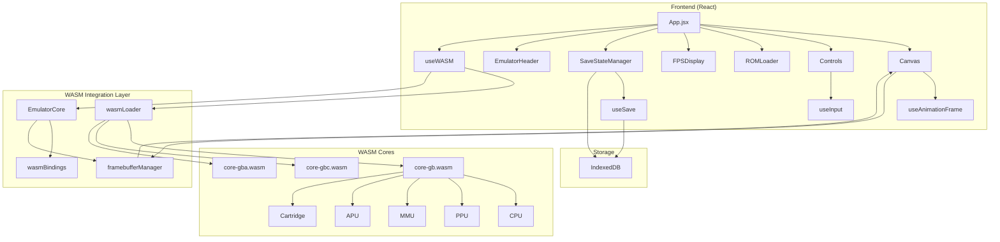
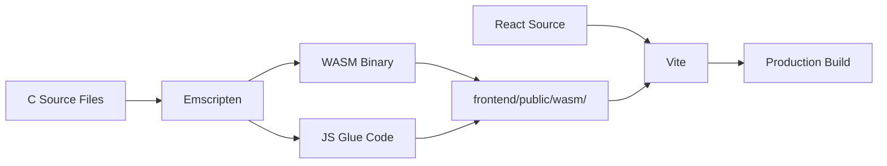

# NeoBoy Architecture Documentation

This document provides a comprehensive overview of the NeoBoy emulator architecture.

## System Architecture



## Component Breakdown

### Frontend Layer

**React Components:**
- `App.jsx` - Main application container
- `Canvas.jsx` - Framebuffer rendering (60 FPS)
- `Controls.jsx` - Start/Select buttons and control panel
- `ROMLoader.jsx` - File picker for ROM loading
- `FPSDisplay.jsx` - Real-time FPS counter
- `SaveStateManager.jsx` - Save/load state management
- `EmulatorHeader.jsx` - Header with branding

**Custom Hooks:**
- `useWASM.js` - WASM lifecycle management
- `useInput.js` - Keyboard and gamepad input
- `useSave.js` - IndexedDB persistence
- `useAnimationFrame.js` - 60 FPS rendering loop

### WASM Integration Layer

- `wasmLoader.js` - Dynamic WASM module loading
- `wasmBindings.js` - High-level EmulatorCore wrapper
- `framebufferManager.js` - Efficient framebuffer transfer

### WASM Cores

Each core (GB, GBC, GBA) consists of:
- **CPU** - Processor emulation
- **PPU** - Graphics rendering
- **MMU** - Memory management
- **APU** - Audio synthesis (placeholder)
- **Cartridge** - ROM/MBC handling

## Data Flow

1. **ROM Loading:**
   ```
   User selects ROM → ROMLoader → useWASM → wasmBindings → core.load_rom
   ```

2. **Frame Rendering:**
   ```
   useAnimationFrame → wasmBindings.stepFrame → core.step_frame
   → framebufferManager → Canvas (60 FPS)
   ```

3. **Input Handling:**
   ```
   Keyboard/Gamepad → useInput → wasmBindings.setButton → core.set_button
   ```

4. **Save States:**
   ```
   SaveStateManager → wasmBindings.save → core.save_state → IndexedDB
   ```

## Build Pipeline



## Memory Layout

### WASM Memory
- Shared linear memory between JS and WASM
- Framebuffer allocated in WASM memory
- Direct typed array access from JS

### Storage
- **IndexedDB** - Save states and SRAM
- **LocalStorage** - Settings and preferences

## Performance Considerations

1. **Zero-copy Framebuffer** - Direct memory access via TypedArray
2. **RequestAnimationFrame** - Browser-optimized rendering
3. **WASM Optimization** - `-O3` compiler flags
4. **Minimal Memory Allocation** - Reuse buffers where possible

## Security

- WASM runs in sandboxed environment
- No arbitrary file system access
- ROM data stays in browser memory
- Save states stored locally (IndexedDB)

## Future Enhancements

1. **Audio Implementation** - Full APU emulation
2. **Link Cable** - Multiplayer support
3. **Debugging Tools** - CPU state viewer, memory editor
4. **Mobile Support** - Touch controls and responsive design
5. **Shader Effects** - CRT filters, color correction
